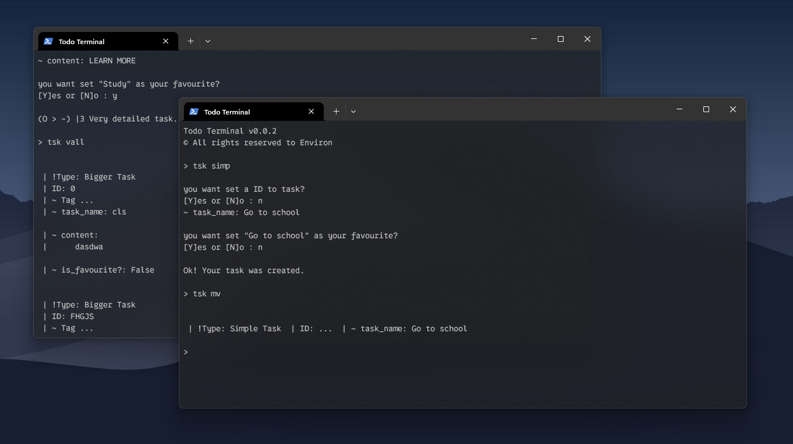

# TSK DOC BETA

This is a TodoApp or TodoSystem, in Terminal Format, create and manage your day with TodoTerminal, sure, if you have courage.

prefix: `>`

</img>

<details>
  <summary><h3><b> Quick Task? 🤔 </b></h3></summary>
   
   ```
   > qk
   
   ~ task_name: Do my homework
   
   WoW! be quick.
   ```
   
   `tsk vall` of a quick task.
   
   ```
   > tsk vall
   
   | !Type: Quick Task
   | ID: 0
   | ...
   | ~ task_name: Do my homework
   | ...
   | ~ is_favourite?: False
   
   ```

</details>

<details>
   <summary><h3><b> How create your first simple task? 🥸</b></h3></summary>
   
   ```
   > tsk simp
   
   you want set a ID to task?
   [Y]es or [N]o : n
   
   ~ task_name: Go learn Java
   
   you want set "Go learn Java" as your favourite?
   [Y]es or [N]o : n
   
   Ok! Your task was created.
   ```
   
   `tsk vall` to view task.
   
   ```
   > tsk vall
   
   | !Type: Simple Task
   | ID: 0
   | ~ Tag ...
   | ~ task_name: Go learn Java
   | ~ content ...
   | ~ is_favourite?: False
   
   ```
      
</details>

<details>
   <summary><h3><b> How Create a bigger task? 🗿🍷</b></h3></summary>
   
   ```
   > tsk bigg
   
   you want set a ID to task?
   [Y]es or [N]o : y
   
   ~ ID: 20F2
   
   ~ task_name: Go learn Java
   
   ~ content: Try learn Java language.
   
   you want set "Go learn Java" as your favourite?
   [Y]es or [N]o : n
   
   
   Success! Very detailed task.
   ```
   
   `tsk vall` of a bigger task.
   
   ```
   > tsk vall
   
   | !Type: Bigger Task
   | ID: 20F2
   | ~ Tag ...
   | ~ task_name: Go learn Java
   
   | ~ content:
   |      Try learn Java language.
   
   | ~ is_favourite?: False
   
   ```
   
   `is_your_favorite` if you type `Y`, a task created will be your favourite. <br>
   `set_ID?` if you type `Y`, you will be able to create a ID to your task.

   
</details>

<details>
   <summary><h3><b> How to view all my tasks? 😶‍🌫️</b></h3></summary>

   ```
   > tsk vall
   
   | !Type: Bigger Task
   | ID: 20F2
   | ~ Tag ...
   | ~ task_name: Go learn Java
   
   | ~ content:
   |      Try learn Java language.
   
   | ~ is_favourite?: False
   
   ```
   
   `Tag`: show that type of task is it, to job', 'to school'. <br>
   `ID`: if you setted a ID, it appear here. <br>
   `task_name`: name of your task. <br>
   `content`: contents of your task. <br>
   `is_favourite?`: if your task is favourite or not.
   
      
</details>

<details>
   <summary><h3><b> How to view task in a simple format? 🍷 </b></h3></summary>

   ### - Using `tsk mv` command:

   ```
   > qk
   
   ~ task_name: Go to work
   
   Nice! be quick.
   
   > tsk mv
   
   | !Type: Quick Task  | ID: ...  | ~ task_name: Go to work  
   
   ```   
</details>

<details>
  <summary><h3><b> How TAGS work in TSK? 👀</b></h3></summary>

  TAGS is a form of classify a task, for example, create a task just for work or school and create tasks to set there.
  
  In Practice:
  
  1. Create a tag
     
  ```
  > tsk tagdo
  
  ~ tag_name: For study
  
  Nice! Tag created.
  ```
  
  2. Create a task (Simple task or Bigger Task)
     
  ```
  > tsk simp
  
  you want set a ID to task?
  [Y]es or [N]o : y
  
  ~ ID: 202F
  
  ~ task_name: Go learn Kotlin
  
  you want set "Go learn Java" as your favourite?
  [Y]es or [N]o : n
  
  Ok! Your task was created.
  ```
  
  3. Set a task in a tag 'For study'
     
  ```
  > tsk tagset
  
  ~ tag_name: For study
  ~ ID_task or task_name: Go learn Kotlin or 202F
  
  Okay! Now, 'Go learn Kotlin' > 'For study' tag.
  ```
  
  This way, I have a specific task for the study.
  

</details>


<details>
  <summary><h2><b> Use Todo Terminal ( ﾉ ﾟｰﾟ)ﾉ <b></h2></summary>
  <br>
  <p>I know that you not go use this program to organize your tasks, I think, but, If you want, Do it below.</p>

  Copy and Paste this in your `Terminal`:
  ```
  cd .\Documents\; git clone https://github.com/G4brielXavier/TodoTerminal.git
  ```

  
  
  NOW ENJOY! I Think, UwU
</details>
